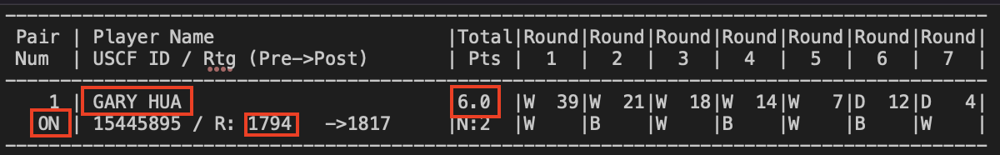
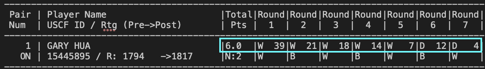

```{r setup, include=FALSE}
library(tidyverse)
library(dplyr)
```

## Overview

The point of this project is to take a text file formatted in a certain way, mold the data into a .csv, and do some calculations in order to get certain aggregations of data for each row. The necessary fields in this .csv are:

- Player's Name
- Player's State
- Total Number of Points
- Player's Pre-Rating
- Average Pre-Chess Rating of Opponents

The first four are found easily in the text file:



The last requires calculating an average pre-rating based on the opponents faced which are outlined below:



For Gary Hua, his output in the final .csv should read like this:
Gary Hua, ON, 6.0, 1794, 1605

## Data Clean-Up

Based on the data, we see that `|` is used as a separation indicator in the file.

```{r data}
# Get the data from tournamentinfo.txt
chess_df <- read.delim(
  file=
    "https://raw.githubusercontent.com/addsding/data607/main/project1/tournamentinfo.txt"
  , header = FALSE, sep="|"
  )
head(chess_df, 10)
```

We can see here that rows 1-4 are not necessary as they were just the headers, and then every other row after that with a bunch of dashes (`-`) are just filler. We can remove these.

```{r remove_filler}
chess_df <- filter(chess_df, !grepl(pattern = "[-]+", V1)) |>
  filter(row_number() > 2)
head(chess_df)
```

Now, the data holds all relevant information, just broken up into different rows. For example, for Gary, we can see that rows one and two hold information just for him. Row one has his player number, player name, total points, and all the players he faced. Row two has his pre-rating.

We can split this one data frame into two now based on every other row, then merge them after.

```{r split}
chess_df_2 = chess_df[seq(1, nrow(chess_df), 2), ]
chess_df_3 = chess_df[seq(0, nrow(chess_df), 2), ]
```

Now we have two data frames to clean up -- let's start with `chess_df_2`

### Part 1: Player Name, Total Points, Round Information

```{r chess_df_2}
head(chess_df_2)
```

We can start with renaming fields.

```{r chess_df_2_rename}
colnames(chess_df_2)[colnames(chess_df_2) == "V1"] = "player_id"
colnames(chess_df_2)[colnames(chess_df_2) == "V2"] = "player_name"
colnames(chess_df_2)[colnames(chess_df_2) == "V3"] = "total_points"
colnames(chess_df_2)[colnames(chess_df_2) == "V4"] = "round_1"
colnames(chess_df_2)[colnames(chess_df_2) == "V5"] = "round_2"
colnames(chess_df_2)[colnames(chess_df_2) == "V6"] = "round_3"
colnames(chess_df_2)[colnames(chess_df_2) == "V7"] = "round_4"
colnames(chess_df_2)[colnames(chess_df_2) == "V8"] = "round_5"
colnames(chess_df_2)[colnames(chess_df_2) == "V9"] = "round_6"
colnames(chess_df_2)[colnames(chess_df_2) == "V10"] = "round_7"
head(chess_df_2)
```

Next, the round numbers should just have the `player_id` and not a W/L/D indication -- time to fix that. There may be nulls for those that aren't W/L/D, such as those that are H/B.

```{r chess_df_2_rounds}
chess_df_2$round_1 <- gsub("[WDL]\\s+", '', chess_df_2$round_1)
chess_df_2$round_2 <- gsub("[WDL]\\s+", '', chess_df_2$round_2)
chess_df_2$round_3 <- gsub("[WDL]\\s+", '', chess_df_2$round_3)
chess_df_2$round_4 <- gsub("[WDL]\\s+", '', chess_df_2$round_4)
chess_df_2$round_5 <- gsub("[WDL]\\s+", '', chess_df_2$round_5)
chess_df_2$round_6 <- gsub("[WDL]\\s+", '', chess_df_2$round_6)
chess_df_2$round_7 <- gsub("[WDL]\\s+", '', chess_df_2$round_7)

chess_df_2$round_1 <- gsub("[HB]\\s+", NA, chess_df_2$round_1)
chess_df_2$round_2 <- gsub("[HB]\\s+", NA, chess_df_2$round_2)
chess_df_2$round_3 <- gsub("[HB]\\s+", NA, chess_df_2$round_3)
chess_df_2$round_4 <- gsub("[HB]\\s+", NA, chess_df_2$round_4)
chess_df_2$round_5 <- gsub("[HB]\\s+", NA, chess_df_2$round_5)
chess_df_2$round_6 <- gsub("[HB]\\s+", NA, chess_df_2$round_6)
chess_df_2$round_7 <- gsub("[HB]\\s+", NA, chess_df_2$round_7)

head(chess_df_2)
```

Next, time to reformat some of these fields to be numbers if they're numbers.

```{r chess_df_2_reformat}
chess_df_2$player_id <- as.numeric(as.character(chess_df_2$player_id))
chess_df_2$total_points <- as.numeric(as.character(chess_df_2$total_points))
chess_df_2$round_1 <- as.numeric(as.character(chess_df_2$round_1))
chess_df_2$round_2 <- as.numeric(as.character(chess_df_2$round_2))
chess_df_2$round_3 <- as.numeric(as.character(chess_df_2$round_3))
chess_df_2$round_4 <- as.numeric(as.character(chess_df_2$round_4))
chess_df_2$round_5 <- as.numeric(as.character(chess_df_2$round_5))
chess_df_2$round_6 <- as.numeric(as.character(chess_df_2$round_6))
chess_df_2$round_7 <- as.numeric(as.character(chess_df_2$round_7))

glimpse(chess_df_2)
```
We can see that `player_id`, `total_points`, and all the rounds are now numbers as they should be. 

Now, let's try to clean up `chess_df_3`.

### Part 2: State, Pre-Rating

```{r chess_df_3}
head(chess_df_3)
```

We can start with renaming the columns and also extracting pre-rating.

```{r chess_df_3_clean}
# rename the state column
colnames(chess_df_3)[colnames(chess_df_3) == "V1"] = "state"

# find "R: [number] in the string with the pre-rating
chess_df_3$match <- sub(pattern = ".*(R:\\s+([0-9]+)).*", 
                replacement = "\\1", x = chess_df_3$V2)
# \\s+ because it seems like there are some cases where 
# the data is formatted inconsistently 
# (more than one space before the number)

# remove the "R: " part
chess_df_3$pre_rating <- gsub("R:\\s+", '', chess_df_3$match)

# make it numeric
chess_df_3$pre_rating <- as.numeric(as.character(chess_df_3$pre_rating))

head(select(chess_df_3, state, pre_rating))
```

Next, I want to join the two data frames together. There's no key to join them on, but I know that the `player_id` column in `chess_df_2` (also known as pair num in the original data field) is an incrementing value starting at 1, so I'll be just numbering each row in `chess_df_3` and then joining both data frames on that new field since I know that the first row in `chess_df_2` matches the first row in `chess_df_3` and so on.

```{r merge_dfs}
# add new player_id field to the second data frame
chess_df_3 <- chess_df_3 |> 
  mutate(player_id = row_number())

# join them together 
chess_df_all <- merge(chess_df_2, chess_df_3, by = "player_id")

# take only the relevant columns
chess_df_all<- select(
  chess_df_all
  , player_id
  , player_name
  , state
  , total_points
  , pre_rating
  , round_1
  , round_2
  , round_3
  , round_4
  , round_5
  , round_6
  , round_7
  )

head(chess_df_all)
```

We have 4/5 of the desired fields now! It's time to calculate average pre-rating chess of each person's opponents now. 

### Part 3: Average Opponent Pre-Rating

To find the average opponent pre-rating, we can do this by pivoting the table by person with all the round numbers, appending the opponent's pre-rating, and then averaging all them.

```{r pre_rating}
# create the pivot
round_pivot <- chess_df_all |>
  pivot_longer(
    cols = starts_with("round_"),
    names_to = "round", 
    values_to = "opponent_player_id",
    values_drop_na = TRUE
  )

# append the opponent's pre-rating 
round_pivot <- left_join(
  round_pivot
  , select(chess_df_all, player_id, pre_rating)
  , by=c('opponent_player_id' = 'player_id')
  )

# average the opponent's pre-rating by the player
average_opponent_pre_rating <- round_pivot |>
  group_by(player_id, player_name) |>
  summarise(average_opponent_pre_rating = mean(pre_rating.y), .groups = 'drop') |>
  arrange(average_opponent_pre_rating)

head(average_opponent_pre_rating)
```

Now that we have the average opponent pre-rating, it's time to append that to the final data frame.

```{r final}
# join the data frame with average_opponent_pre_rating to our original one
chess_df_all <- merge(
  chess_df_all
  , select(average_opponent_pre_rating, player_id, average_opponent_pre_rating)
  , by = "player_id"
  )

# select only relevant columns for the final output
chess_df_final <- select(
  chess_df_all
  , player_name
  , state
  , total_points
  , pre_rating
  , average_opponent_pre_rating
  )

# write it all to a .csv
write.csv(chess_df_final, "tournament.csv", row.names=TRUE)
tournament_final <- read.csv("tournament.csv")
head(tournament_final)
```

The .csv has been created and then pulled from -- done!

Note: I see that `average_opponent_pre_rating` is an integer in the example given, however I kept it a double as I personally think it's helpful to see some decimals. To round it though, it would be as simple as doing `tournament_final$average_opponent_pre_rating <- round(tournament_final$average_opponent_pre_rating)`.

## Conclusion
This text file was definitely a little tricky to parse, but at the very least it was consistently formatted so it was able to end up in a data frame without too much work. With this file now, one could potentially set up a simple model to predict how many points a player is going to get with their pre-rating and the average pre-ratings of their opponents. It could also just generally be used to predict whether the player would win a match or not, as well as predict perhaps what their after-tournament rating is. These cleaning scripts could also be used again with a file formatted the same way if next year's results come out in the same fashion too.